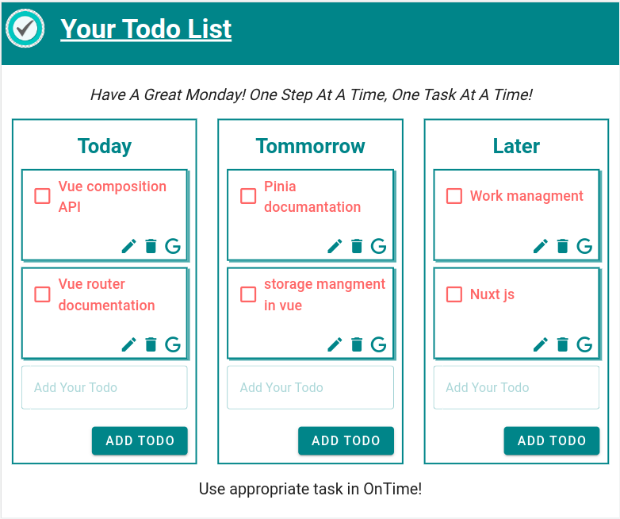

# Todo-list application/ Extension

## Recommended IDE Setup

- [VS Code](https://code.visualstudio.com/) + [Volar](https://marketplace.visualstudio.com/items?itemName=Vue.volar) (and disable Vetur) + [TypeScript Vue Plugin (Volar)](https://marketplace.visualstudio.com/items?itemName=Vue.vscode-typescript-vue-plugin).

## Project setup
```
npm install
```

### Compiles and hot-reloads for development
```
npm run serve
```

### Compiles and minifies for production
```
npm run build
```

## Testing locally on Chrome

In order to test the package holding the extension in Chrome we need to:
1. Go to `chrome://extensions/` page.
2. Toggle `Developer mode` ON.
3. Select `Load Unpacked`.
4. Select the `/dist` directory.

## Todo application preview



### Vue 3 + Vite

This template should help get you started developing with Vue 3 in Vite. The template uses Vue 3 `<script setup>` SFCs, check out the [script setup docs](https://v3.vuejs.org/api/sfc-script-setup.html#sfc-script-setup) to learn more.

### Information (PoC work): Todo application 
1. In this you can use your todo list as an extension popup ( Branch: [master](https://github.com/Moksha-S/Todo-ext)) 
2. In this on every new tab you find your todo list extension page ( Branch: [on-new-page](https://github.com/Moksha-S/Todo-ext/tree/on-new-page)) 


# Author
### Moksha Shah:-  [shahmoksham@gmail.com]( shahmoksham@gmail.com)